# Ecommerce After-Sales Logistics Agent

A local, synthetic customer-service portfolio prototype that tests whether a bounded logistics-investigation Agent adds measurable value over a strong deterministic Workflow.

The customer-facing surface behaves like a logistics support Agent: it acknowledges the problem, explains what it found, and asks before taking the only supported next step. Internally, lightweight triage extracts intent, deterministic code enforces authorization, a single LangGraph Agent chooses read-only observations, and a deterministic Evidence Gate decides whether the system may offer a logistics investigation. The customer must confirm the exact hidden proposal identity and version before a simulated idempotent write.

## Current maturity

`G1 local portfolio prototype` / `T1 synthetic low external impact`.

Final Phase 2 closeout:
`phase_2=complete`, `portfolio_release_candidate=verified`,
`architecture_conclusion=PREFER_WORKFLOW`, `expansion_status=STOP`,
`maintenance_mode=docs_and_bugfixes_only`.

The release candidate is bound to F-final
`9a947e78b60adf6151b397a678105896b8115aa1`. Its trusted release evidence,
including Live provider, Live Edge, operational clean-start, Retrieval Locked,
and 132-run Locked gates, passes. The sanitized Evidence Pack is bound through
C-final `f0cc7be5eebf7eb5262163719b98eef53f54a7f0` and B-final
`e5b03ce8cecd8d2245816abed9612e3dbd4a493e`.

Phase 1 of the V2 route additionally makes every declared Manifest assertion
executable through a fail-closed grader registry and requires a sanitized,
two-revision Evidence Pack for any current release claim. A freeze or ignored
delivery report tied to an earlier source revision is historical evidence only;
it never substitutes for a fresh V2 Pilot, versioned freeze, locked result, and
Evidence Pack.

Phase 2 completes the same narrow Controlled Policy RAG contract without
expanding the product. It uses only a fictional, versioned policy corpus and a
pinned local embedding model; retrieval candidates are never authoritative.
The deterministic Resolver checks the complete canonical authority set for the
trusted issue, service level, region, and evaluation time before it can decide
`not_applicable` or `version_conflict`; a unique authority missed by retrieval
is a fail-closed `no_hit`. The historical Phase 1 latency failure and the F2
operational timeout are retained as failures; the latter was diagnosed as a
10-second client timeout against a 41.739-second local Policy RAG cold start,
then repaired with bounded stage-specific timeouts and rebuilt evidence.

## What this project demonstrates

- native LLM tool calling inside a bounded LangGraph loop;
- deterministic authorization, policy, evidence, proposal, and execution boundaries;
- `absent` versus `unavailable` evidence semantics;
- immutable customer-confirmed proposals, idempotent writes, read-back verification, and `uncertain` outcomes;
- developer-visible trace without raw chain-of-thought;
- a fair Agent-versus-strong-Workflow evaluation with hard safety gates.

## Final architecture and data path

`PREFER_WORKFLOW` is the evidence-backed product conclusion. The single native
tool-calling Agent remains an experimental comparison path; the deterministic
Workflow is the preferred architecture for this narrow loop. Both share the
same authorization, six read tools, Policy Resolver, Evidence Gate, Proposal,
executor, fixtures, budgets, and response layer.

```mermaid
flowchart LR
    M[Customer free text] --> T[LLM triage\nintent / risk / order IDs]
    T --> R[Deterministic router\nidentity + supported scope]
    R --> C[Authorized InvestigationCase]
    C --> A[Experimental Agent\nLangGraph + ToolNode]
    C --> W[Preferred Workflow\nconditional read path]
    A --> RT[Six governed read tools]
    W --> RT
    RT --> U[Untrusted observations\nretrieval candidates / metadata / score]
    U --> V[Policy Resolver\ncanonical clause + normalized facts]
    V --> G[Deterministic Evidence Gate]
    G --> P[Reply or immutable proposal]
    P --> X[Exact customer confirmation]
    X --> E[Idempotent executor + read-back]
    E --> S[Persisted state/events + SSE replay]
```



The retriever proposes candidates only. Citation/provenance is reloaded and
verified from canonical policy data; normalized facts are the only policy input
to the Evidence Gate. Policy prose remains untrusted explanatory material and
is not model authority.

## Local Mock start

```bash
cd /Users/tristana/Develop/ecommerce-after-sales-agent
uv sync --locked --python 3.12
LLM_MODE=mock POLICY_RETRIEVAL_MODE=real_local uv run uvicorn after_sales_agent.api.app:app --app-dir src --host 127.0.0.1 --port 8000
```

In a second terminal:

```bash
cd frontend
npm ci
VITE_API_BASE_URL=http://127.0.0.1:8000 npm run dev -- --host 127.0.0.1 --port 5173
```

Open `http://127.0.0.1:5173`. Mock and Live are explicit modes. The final
release evidence is Live, while this local command is the repeatable Mock demo.

Controlled Policy RAG is independently explicit: the runtime/demo path uses a
pinned real local embedding model and local cosine index, while `fake_test` is
allowed only in automated tests. A real local embedding result is not a Live
LLM result. The Developer Trace may show a bounded, source-hash-bound canonical
excerpt labelled as untrusted explanatory text; that prose is omitted from the
Agent's model-visible tool result and never serves as Evidence Gate authority.

## Live demo

Keep the same frontend command and start the API with the explicit Live mode:

```bash
cd /Users/tristana/Develop/ecommerce-after-sales-agent
LLM_MODE=live POLICY_RETRIEVAL_MODE=real_local uv run uvicorn after_sales_agent.api.app:app --app-dir src --host 127.0.0.1 --port 8000
```

The owner-supplied `DEEPSEEK_API_KEY` stays in the ignored local environment;
its value is never printed or copied into evidence. Live failure never falls
back to Mock.

## Evaluation operator flow

```bash
cd /Users/tristana/Develop/ecommerce-after-sales-agent
uv run after-sales-eval validate
LLM_MODE=mock POLICY_RETRIEVAL_MODE=real_local \
  uv run after-sales-eval retrieval-development \
  --revision phase2-final-retrieval-dev-20260825-r1
uv run after-sales-eval pilot \
  --revision phase2-final-live-pilot-20260825-r1 \
  --mode live --timeout 120 --concurrency 2
uv run after-sales-eval freeze \
  --pilot-revision phase2-final-live-pilot-20260825-r1 \
  --retrieval-development-revision phase2-final-retrieval-dev-20260825-r1 \
  --evaluation-revision acceptance-live-phase2-policy-rag-20260825-r3
LLM_MODE=mock POLICY_RETRIEVAL_MODE=real_local \
  uv run after-sales-eval retrieval-locked \
  --freeze evals/config/freezes/acceptance-live-phase2-policy-rag-20260825-r3.json
uv run after-sales-eval locked \
  --freeze evals/config/freezes/acceptance-live-phase2-policy-rag-20260825-r3.json \
  --concurrency 2
```

The commands above describe the registered flow. The final F-final reports were
already run from the clean frozen revision; do not overwrite them from the
documentation-only D-final. Every failed, timed-out, or over-budget attempt is
retained.

## Final Evidence Pack inspection

The final Pack is
`delivery/evidence-packs/acceptance-live-phase2-policy-rag-20260825-r3/`.
Its trusted lineage was verified on B-final; the verification command is shown
for reproducibility and must be run from B-final, not after the D-final docs
commit:

```bash
uv run python scripts/generate_evidence_pack.py verify \
  --pack delivery/evidence-packs/acceptance-live-phase2-policy-rag-20260825-r3
```

The Pack contains only the sanitized payload, its content digest, and the
lineage binding. Raw runs, provider payloads, policy passages, PII, secrets,
fault seeds, and stack traces remain excluded.

## What it does not do

It does not connect to real marketplaces or carriers, process refunds/compensation/returns, use production data, run multiple agents, use generic or user-managed RAG/MCP/long-term memory, or claim production readiness. The sole knowledge exception is the narrowly controlled fictional Policy RAG described in `PROJECT.md`. See `NON_GOALS.md`.

## Documentation map

- `PROJECT.md` — canonical status, authority, lifecycle, and decisions
- `docs/PRODUCT-SPEC.md` and `docs/UX-SPEC.md` — product and surface contract
- `docs/ARCHITECTURE.md` and `docs/DOMAIN-CONTRACTS.md` — runtime and domain contracts
- `docs/API-REFERENCE.md` — API and SSE contract
- `docs/EVALUATION.md` — datasets, metrics, gates, and Agent-versus-Workflow decision rule
- `docs/SECURITY-PRIVACY.md` — trust boundaries and threat treatment
- `docs/IMPLEMENTATION-PLAN.md` and `docs/TRACEABILITY.md` — slices and acceptance mapping
- `docs/FRAMEWORK-INTEGRATION.md` and `docs/AGENT-MODULE-MATRIX.md` — exact framework route and ownership

Detailed startup, configuration, evidence labels, and current results live in
`docs/STARTUP.md`, `docs/CONFIGURATION.md`, and `docs/TEST-REPORT.md`. Do not
infer Live capability from Mock fixtures, a configured key, or an old
provider-only probe.
